<div align="center">


<br/>

<a href="https://github.com/Scarface96?tab=repositories"></a>
<a href="https://www.linkedin.com/in/tony-mulunda"></a>

</div>

---

## 👨‍💻 About Me

I’m **Tony Mulunda**, a data analyst and front-end developer. I turn raw data into decisions people can act on, and I build the interfaces that put those answers in front of them.

- 📊 I analyse data with **Python, SQL, Excel, Power BI and Tableau**, and query it with **PostgreSQL, MySQL and DuckDB**.
- 🧠 I build and compare predictive models with **scikit-learn** and **statsmodels**, and explain them in business terms: odds ratios, lift, and what a retention campaign is worth.
- 🔁 My analysis is **code, not screenshots**: tested Python pipelines that rebuild interactive **Plotly** reports and publish them with **GitHub Actions** whenever the data or code changes.
- 💻 I build responsive web apps with **React, JavaScript, Tailwind and Firebase**.
- 🚀 I’m looking for **Data Analyst, BI Analyst and Junior Data Engineering** roles.

---

## 🧩 Core Skills

<div align="center">

### Data & Analytics


<br/>


<br/>


### Web Development


</div>

---

## ⭐ Top Data Project

<a href="https://github.com/Scarface96/Bank-Customer-Churn-Classification">
  
</a>

**Bank Customer Churn Classification.** Which of a bank's 10,000 customers are about to leave, and how many should it call? I compared four cross-validated models (gradient boosting reaches **0.86 ROC AUC**) and built an explainable logistic regression that lifts the simple model from 0.77 to **0.84** while staying transparent. The live report includes an **in-browser churn-risk calculator** and a **retention budget planner** that finds the most profitable number of customers to contact.

[**Live report →**](https://scarface96.github.io/Bank-Customer-Churn-Classification/) · [Code →](https://github.com/Scarface96/Bank-Customer-Churn-Classification)

---

## 📊 More Data & BI Projects

Every project below has a tested Python pipeline that rebuilds an interactive report automatically, alongside the original Power BI, Tableau, Excel or SQL work.

<table>
<tr>
<td width="50%" valign="top">

### 💼 B2B Sales Pipeline

**1,432 of 1,589 open deals are older than nearly any deal ever won.** Win rates with confidence ranges show top agents win on volume, not skill at closing.

Excel · Python · statistics · weighted pipeline forecast

[Live report](https://scarface96.github.io/B2B-Sales-Pipeline-CRM-Dashboard-for-TechSolutions-Inc./) · [Code](https://github.com/Scarface96/B2B-Sales-Pipeline-CRM-Dashboard-for-TechSolutions-Inc.)

</td>
<td width="50%" valign="top">

### 👥 HR Attrition Analysis

**53% of entry-level staff who work overtime have left.** A logistic-regression drivers model shows pay and marital status stop mattering once seniority is held equal.

Tableau · Python · statsmodels · segment explorer

[Live report](https://scarface96.github.io/HR-Analysis-Dashboard/) · [Code](https://github.com/Scarface96/HR-Analysis-Dashboard)

</td>
</tr>
<tr>
<td width="50%" valign="top">

### 🧸 Toy Store KPI Report

**Sales grew 31%, but profit only 16%.** The mix shifted to low-margin lines while the most profitable product halved. ABC analysis and a backtested Q4 forecast.

Power BI · DAX · Python · forecasting

[Live report](https://scarface96.github.io/Toy-Store-KPI-Report/) · [Code](https://github.com/Scarface96/Toy-Store-KPI-Report)

</td>
<td width="50%" valign="top">

### 🌍 Global CO₂ Emissions

**The US emitted 24% of all CO₂ in history; China now emits 31% of each year's.** Animated per-capita map, decoupling analysis and a country explorer.

Tableau · Python · Plotly

[Live report](https://scarface96.github.io/Global-CO2-Emissions-Dashboard/) · [Code](https://github.com/Scarface96/Global-CO2-Emissions-Dashboard)

</td>
</tr>
<tr>
<td width="50%" valign="top">

### 🛍️ Retail Sales SQL

**Every customer was won in 2022; none arrived in 2023.** All ten SQL questions run live in DuckDB, plus RFM segmentation, cohort retention and an in-browser SQL editor.

PostgreSQL · DuckDB · window functions

[Live report](https://scarface96.github.io/sql_retail_sales_p1/) · [Code](https://github.com/Scarface96/sql_retail_sales_p1)

</td>
<td width="50%" valign="top">

### 🍽️ Restaurant Order Analysis

**Six dishes are both cheap and rarely ordered.** Menu engineering, busy-hour heatmaps and basket analysis on 12,234 ordered items.

MySQL · DuckDB · market-basket analysis

[Live report](https://scarface96.github.io/Restaurant-Order-Analysis/) · [Code](https://github.com/Scarface96/Restaurant-Order-Analysis)

</td>
</tr>
<tr>
<td width="50%" valign="top">

### 🦠 COVID-19 Data Exploration

**South Africa's excess deaths were about 3× its reported COVID toll.** T-SQL queries run on Our World in Data figures, with wave-by-wave fatality and vaccination by continent.

T-SQL · DuckDB · Python

[Live report](https://scarface96.github.io/covid-project/) · [Code](https://github.com/Scarface96/covid-project)

</td>
<td width="50%" valign="top">

### ⚙️ How these reports are built

```
data ─► pandas / DuckDB ─► tests (pytest)
     ─► models & SQL ─► Plotly report
     ─► GitHub Actions ─► GitHub Pages
```

Each push re-runs the analysis, so every number on a report comes from code anyone can check.

</td>
</tr>
</table>

---

## 💻 Web Development Projects

<table>
<tr>
<td width="50%" valign="top">

### 🎬 Reelhouse (Netflix-style clone)

Streaming-style film browser with embedded trailers, search, genre rows, Firebase accounts and a My List that syncs across devices.

React · Tailwind · Firebase · TMDB API

[Live app](https://scarface96.github.io/netflix-clone/) · [Code](https://github.com/Scarface96/netflix-clone)

</td>
<td width="50%" valign="top">

### 🌦️ Live Weather

Hourly and 7-day forecasts, city search, "use my location", and a background sky that matches the real weather. No API key needed.

React · Open-Meteo API

[Live app](https://scarface96.github.io/weather-react-app/) · [Code](https://github.com/Scarface96/weather-react-app)

</td>
</tr>
<tr>
<td width="50%" valign="top">

### 🍿 Movie Search

Search every film and series on IMDb with type and year filters, ratings from three sources and a watchlist.

React · OMDb API

[Live app](https://scarface96.github.io/movie-app/) · [Code](https://github.com/Scarface96/movie-app)

</td>
<td width="50%" valign="top">

### ☕ KAIDIS Coffee Shop

Responsive café website designed as a modern, client-ready business landing page.

HTML · CSS · JavaScript

[Live site](https://scarface96.github.io/KAIDIS--Coffee-Shop/) · [Code](https://github.com/Scarface96/KAIDIS--Coffee-Shop)

</td>
</tr>
</table>

<details>
<summary><b>More projects</b></summary>
<br/>

**Data & analytics:** [Airbnb Listings Analysis](https://github.com/Scarface96/AirBnB-Listing-Analysis-Review) · [Customer Purchase Behaviour](https://github.com/Scarface96/Customer_purchase_behaviour)

**Web & JavaScript:** [BMI Calculator](https://github.com/Scarface96/bmi-calculator) · [E-commerce Landing Page](https://github.com/Scarface96/e-commerce-landing-page) · [Payroll Web App](https://github.com/Scarface96/payroll-web-app) · [To-Do List](https://github.com/Scarface96/TO-DO-LIST-MAIN) · [Restaurant Burger House](https://github.com/Scarface96/Restaurant-burger-house) · [Lussagi Agency Website](https://github.com/Scarface96/Lusagi-website) · [Analog Clock](https://github.com/Scarface96/clock-app) · [Red Light, Green Light 3D Game](https://github.com/Scarface96/squid-game) · [Choose Your Adventure](https://github.com/Scarface96/choose-adventure) · [Rock Paper Scissors](https://github.com/Scarface96/rock-paper-scissors)

</details>

---

## 📈 GitHub Activity

<div align="center">


<br/>


<br/><br/>

<picture>
  <source media="(prefers-color-scheme: dark)" srcset="https://raw.githubusercontent.com/Scarface96/Scarface96/output/github-snake-dark.svg" />
  <source media="(prefers-color-scheme: light)" srcset="https://raw.githubusercontent.com/Scarface96/Scarface96/output/github-snake.svg" />
  
</picture>

</div>

---

## 🎯 What I’m Looking For

Roles and projects where I can work on:

- **Data analysis and business intelligence**
- **Dashboards and automated reporting**
- **SQL and Python data pipelines**
- **Junior data engineering**
- **Data-driven web applications**
- **Freelance analytics, dashboard and web projects**

---

<div align="center">

### 🤝 Let’s Build Something Useful

If you’re hiring, collaborating or need someone who combines **data, analytics and development**, explore the live reports above or connect with me on LinkedIn.


<br/><br/>


</div>
